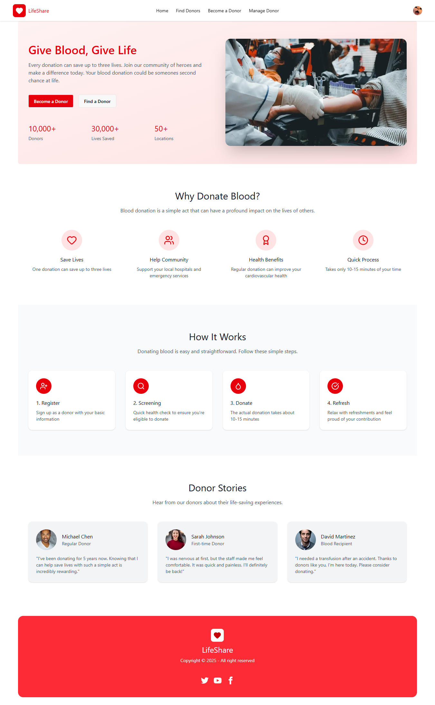
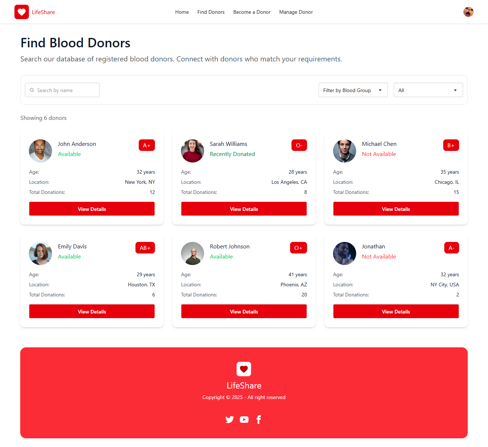
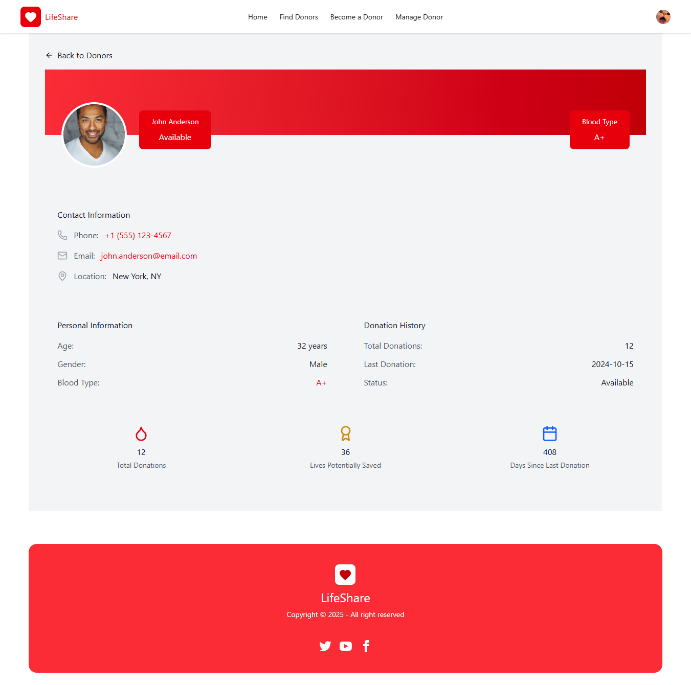
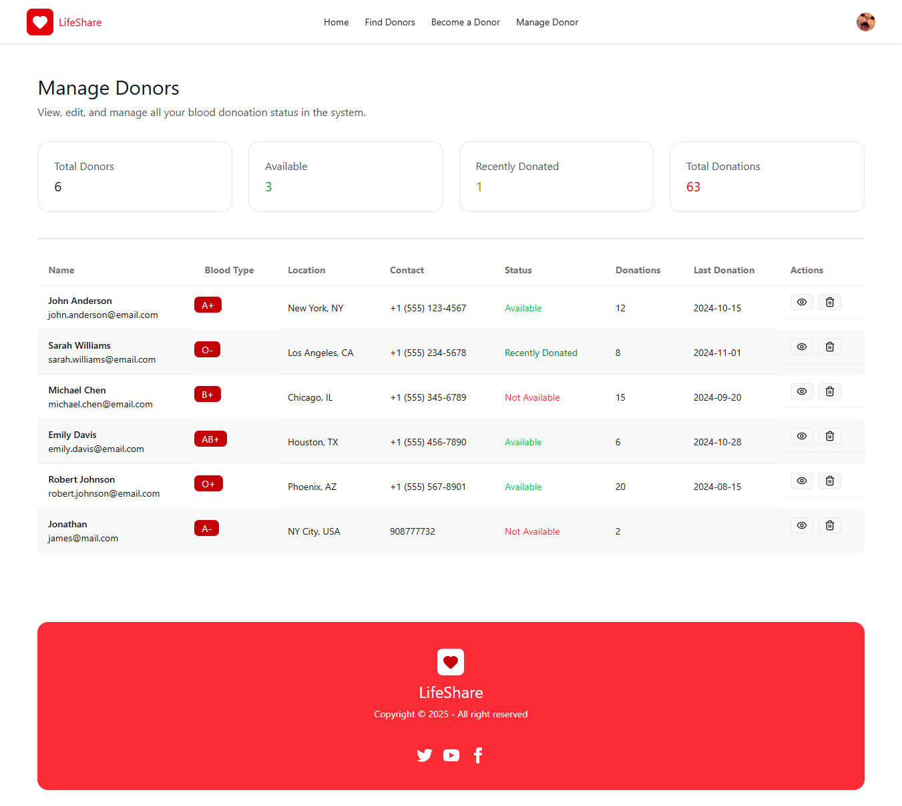

# LifeShare – Global Blood Donation Platform

LifeShare is a modern, user-friendly blood donation platform designed to connect blood donors and recipients across the world.
Users can easily browse available donors, view their details, and manage their own donor profile after authentication.

🌍 Find donors worldwide  
❤️ Save lives with a single donation  
⚡ Fast, secure, and beautifully designed  

Live Website: https://life-share-pearl.vercel.app/  


## 🚀 Tech Stack

LifeShare is built using cutting-edge technologies:  
- Next.js (App Router) – Full-stack React framework for routing, APIs, and SSR
- Tailwind CSS – Utility-first CSS framework for fast UI development
- MongoDB – NoSQL database for storing donor information
- Clerk Auth – Authentication system for login, signup, and secure routing
- SweetAlert2 – Elegant popup dialogs for confirmation & alerts
- SWR – Data fetching with caching & revalidation
- Vercel – Deployment hosting platform  

## 🎯 Features  
### 🔍 Donor Search  
- Filter and view donors by blood group, location, and availability  
- View full donor details on dedicated pages  

### 👤 Authentication (Clerk)  
- Secure login & signup
- Auth-protected routes (e.g., Manage Donors)
- Prevent unauthorized API access using middleware  

### 🩸 Donor Management  
- View all donors
- Delete donors (with SweetAlert confirmation). Only if you're a donor 

### 📁 API Routes (Next.js App Router)  
- Full CRUD operations
- Protected API endpoints using Clerk middleware

### 📱 Responsive UI
- Fully optimized for mobile, tablet, and desktop  

## 🛠️ Installation & Setup

Install my-project with npm

#### 1️⃣ Clone the repository

```bash
git clone https://github.com/IGNIT3-xD/Life-Share
cd lifeshare

```

#### 2️⃣ Install dependencies  

```bash
npm install
```

#### 3️⃣ Setup environment variables  
Create a .env.local file:  

```bash
MONGODB_URI=your_mongodb_connection
NEXT_PUBLIC_CLERK_PUBLISHABLE_KEY=your_key
CLERK_SECRET_KEY=your_secret
```  

#### 4️⃣ Run the development server  

```bash
npm run dev
```  
## 📸 Screenshots

### 🏠 Homepage


### 🔍 Donor Search Page


### 👤 Donor Details Page


### 📊 Manage Donors Panel



